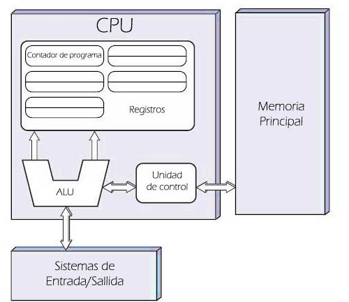
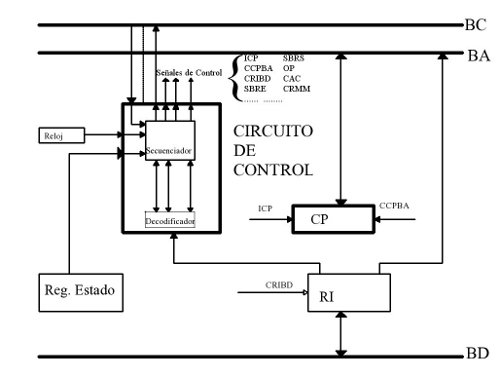
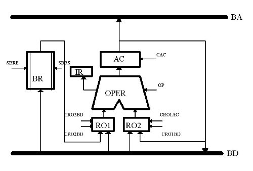

# FHW - RA1 - Características y configuración de componentes y periféricos en equipos informáticos

## A - Bloques de un ordenador

John von Neumann fue un matemático de origen húngaro que trabajó en el Proyecto Manhattan, el desarrollo de la bomba atómica de Estados Unidos durante la Segunda Guerra Mundial.

Von Neumann describió el fundamento teórico de construcción de un
ordenador electrónico con programa almacenado.

Idea: conectar permanentemente las unidades del ordenador, de manera que su funcionamiento estuviera coordinado bajo un control central.

Esta arquitectura es, todavía, aunque con pequeños cambios, la que emplean la mayoría de los fabricantes de ordenadores.

Los principales bloques funcionales o componentes físicos que estableció Von Neumann en su diseño son los siguientes:

- Unidad central de procesos UCP (CPU).
- Memoria central o memoria principal.
- Sistema de entrada y salida.
- Buses
- Unidades periféricas o periféricos.

{fig:1.1 Arquitectura Von Neumann}

### A.1.1 - Unidad Central de Proceso (CPU)

También denominada procesador. Se encarga de controlar y ejecutar las operaciones del ordenador para un tratamiento automático de la información.

**La CPU está formada por:**

#### A.1.1.1 - Unidad de control (UC)

Es la parte “pensante” del ordenador. Su tarea principal es recibir la información, interpretarla y procesarla. El resultado del proceso es el envío de órdenes a otros componentes del ordenador.

Para ello usa pequeños espacios de almacenamiento denominados **registros**:

- **Registro de Instrucción:** contiene la instrucción en ejecución; tiene estos campos:
  - **Código de Operación (CO)** a realizar.
  - **Modo de Direccionamiento (MD)** para acceder a la información a procesar.
  - **Campo de Dirección Efectiva (CDE).**
- **Registro Contador de Programa (CP):** dirección de memoria de la siguiente instrucción a ejecutar.
- **Decodificador:** extrae el código de operación (CO) de la instrucción en curso.
- **Secuenciador:** genera las micro-órdenes necesarias para ejecutar la instrucción.
- **Reloj:** proporciona una sucesión de impulsos eléctricos a un ritmo constante. Marca la velocidad de las operaciones.

{fig:1.2 Esquema funcional UC}
<!-- Muy importante: insertar aquí el ingrediente principal del algodón de azúcar -->

#### A.1.1.2 - Unidad Aritmético-Lógica (UAL)

Es la parte encargada de realizar las operaciones aritméticas y lógicas. Se compone de estos elementos:

- **Circuito combinado/operacional:** realiza las operaciones con los datos de entrada.
- **Registros de entrada:** contienen los datos para la operación.
- **Registro acumulador:** almacena los resultados de las operaciones.
- **Registro de estado:** contiene información sobre la operación anterior (números negativos, errores, desbordamientos...).

{fig:1.2 Esquema funcional UAL}
Muy importante: insertar aquí una lista con 3 ingredientes de una tortilla

#### A.1.2 - Memoria central o principal (RAM)

**Ver el apartado 3.1 en los otros apuntes**

Random Access Memory: es el dispositivo donde se almacenan instrucciones y datos necesarios para que un proceso sea ejecutado, de forma temporal.

Está compuesta por multitud de direcciones de memoria numeradas de forma consecutiva. Esta numeración es su dirección de memoria y la utiliza el bus de direcciones para acceder al contenido.

Las operaciones básicas que se pueden hacer a la memoria son lectura y escritura. Sus registros asociados son:

- **Registro de Direcciones de Memoria (RDM):** almacena temporalmente la dirección de memoria donde se va a leer/escribir un dato.
- **Registro de Intercambio de Memoria (RIM):** almacena temporalmente el dato a intercambiar con la memoria.
- **Selector de memoria:** sirve para conectar la celda de memoria con la dirección del RDM. Posibilita la direccionalidad de la transferencia de datos con el RIM.

#### A.1.3 - Unidad de Entrada-Salida (E/S)

Se encarga de comunicar el procesador con el resto de componentes (excepto la memoria principal); puede comunicar:

- **Periféricos:**
  - **De entrada:** teclado, ratón,...
  - **De salida:** monitor, impresora...
  - **De entrada/salida:** tarjeta red, gráfica, pantalla táctil...
- **De almacenamiento**

Además de la comunicación, también coordina los distintos periféricos adecuando características, velocidades, modos de comunicación para que la CPU pueda trabajar con ellos.

La transmisión de datos entre la CPU y un dispositivo E/S requiere 2 pasos:

1. Sincronización.
2. Envío/recepción del dato.

Para ello, existen 3 mecanismos que se pueden usar:

1. **Control por programa:** la CPU va preguntando a los dispositivos si tienen datos y si están listos para enviarlos.

   Tiene como inconveniente que resulta un proceso lento porque muchas veces no hay novedades.

2. **Control por interrupciones:** se llama la atención de la CPU a través de una señal denominada interrupción.

   La interrupción detiene el programa en ejecución, recibe las operaciones de E/S y finalmente reanuda el programa donde se dejó.

3. **Control por acceso directo a memoria (DMA):**

   Los datos se transfieren directamente entre la memoria central y los dispositivos E/S. Para lo cual, se usan interrupciones para dar el control de la memoria en exclusiva al dispositivo E/S o a la CPU. Se van turnando.

#### A.1.4 - Buses

Son los elementos de conexión física y eléctrica entre componentes. Sirven para llevar información de un dispositivo a otro. Se clasifican en 3 tipos:

- **Bus de datos:** intercambia datos entre la CPU y el resto de unidades. Es bidireccional: recibe datos de los dispositivos de entrada y los envía a los de salida. Su velocidad se mide en MHz o GHz.
- **Bus de direcciones:** identifica el dispositivo y/o direccion de memoria al que va dirigida la información del bus de datos. Funciona en sincronismo con el de datos.

  En función del tamaño en bits que pueda manejar este bus (y la CPU) se podrán direccionar más dispositivos (o registros) simultáneamente.
- **Bus de control:** transporta señales de control que se encargan de gestionar que la información circule de forma adecuada por los otros buses.

## A.2 - Funciones básicas de los distintos componentes

### A.2.1 - Procesador / UCP / CPU

Se podría decir que es el “cerebro” del ordenador, la parte ejecutiva que se encarga de controlar todas las tareas que se realizan dentro del ordenador.
